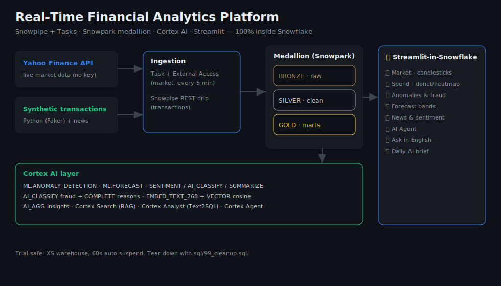

# 📈 Real-Time Financial Analytics Platform


### A full, real-time fintech BI pipeline built **100% inside Snowflake** — Snowpipe + Tasks ingestion, a Snowpark medallion, the entire Cortex AI stack (forecasting, anomaly detection, fraud LLM, RAG, Text2SQL, an agent, embeddings), and a polished Streamlit dashboard.

> **The story:** Live market data and synthetic card-transaction data stream in,
> get refined through a Bronze → Silver → Gold medallion, and are turned into
> anomaly flags, forecasts, explainable fraud alerts, and a natural-language
> analytics app — with **zero data movement, no GPUs, and no spend beyond a
> Snowflake trial.**



---

## 📸 Dashboard

> Screenshots — drop PNGs into `docs/screenshots/` and they'll render here.
> Suggested shots: Market (candlesticks), Anomalies & Fraud (gauge + LLM
> reasons), Forecast (bands), AI Agent.

<!--  -->
<!--  -->

---

## 🎯 What it does

| Capability | How |
|---|---|
| **Real-time ingestion** | Synthetic transactions via **Snowpipe** (REST); live market data via a **serverless Task + External Access Integration** calling Yahoo Finance every 5 min |
| **Transformation** | **Snowpark Python** medallion (Bronze→Silver→Gold), wired as an incremental **Stream/Task DAG** |
| **Anomaly detection** | `SNOWFLAKE.ML.ANOMALY_DETECTION` on daily spend + market volume |
| **Forecasting** | `SNOWFLAKE.ML.FORECAST` for spend (14d) and per-ticker prices (7d), with bands |
| **News sentiment** | `CORTEX.SENTIMENT` + `AI_CLASSIFY` + `SUMMARIZE` on financial news |
| **Explainable fraud** | `AI_CLASSIFY` flags suspicious txns; `CORTEX.COMPLETE` writes the *reason* + recommended action |
| **Vector similarity** | `EMBED_TEXT_768` + `VECTOR_COSINE_SIMILARITY` to find look-alike transactions |
| **AI aggregate insight** | `AI_AGG` summarizes thousands of rows into a few bullets |
| **RAG copilot** | **Cortex Search** over news for grounded answers |
| **Text2SQL** | **Cortex Analyst** over a semantic model |
| **AI Agent** | Routes between Analyst (SQL) and Search (news) and synthesizes |
| **Dashboard** | **Streamlit-in-Snowflake** + Altair — KPI cards, candlesticks, donuts, heatmaps, fraud gauges, forecast bands, daily AI brief |

---

## 🏗️ Architecture

```
Yahoo API ─(External Access)─► Task (5 min) ─► Snowpark SP ─┐
                                                            ├─► BRONZE ─► SILVER ─► GOLD ─► Cortex AI ─► Streamlit
Faker txns ─► files ─► Snowpipe REST drip ──────────────────┘   (Snowpark medallion, Task DAG)
```

- **DB** `RFAP_DB` · **WH** `RFAP_WH` (XS, 60s auto-suspend) · schemas `BRONZE` / `SILVER` / `GOLD`.

---

## 📁 Repository structure

```
realtime-financial-analytics/
├── README.md
├── requirements.txt
├── config/.env.example
├── ingest/            transaction_generator · snowpipe_drip · news_generator · backfill_market
├── sql/               00–16 numbered worksheets + 99_cleanup
├── snowpark/          silver_transform.py · gold_transform.py  (source of truth for the SPs)
├── models/            finance_semantic_model.yaml  (Cortex Analyst)
├── streamlit/         app.py · ui.py · environment.yml
└── docs/              architecture.svg · runbook.md · linkedin_post.md
```

---

## 🚀 Run it

You need a **Snowflake trial** (Cortex-enabled region: AWS `us-west-2`/`us-east-1`
or Azure `east-us-2`).

### ⚡ Trial quickstart (100% in Snowsight, no local setup) — recommended
Trial accounts block **External Access** (so the live Yahoo Task can't run) and
Snowpipe needs local key-pair auth. To stand up the *entire* platform from the
browser alone, use the synthetic-data path — it lands realistic market,
transaction, and news data straight into BRONZE, and everything downstream (all
the AI + the dashboard) works identically. Run these worksheets in order:

```
sql/00_setup.sql              sql/10_cortex_search.sql
sql/02_bronze.sql             sql/11_cortex_fraud.sql
sql/trial_demo/01_load_synthetic.sql   sql/12_vector_similarity.sql
sql/trial_demo/02_build_silver.sql     sql/13_ai_aggregate.sql
sql/trial_demo/03_build_gold.sql       sql/16_gold_views.sql
sql/07_cortex_anomaly.sql
sql/08_cortex_forecast.sql
sql/09_cortex_news_ai.sql
```
Then create a Streamlit app, paste `streamlit/app.py` + `ui.py`, and Run. The
app uses **Altair** (bundled — no package install) and does **Text2SQL with
CORTEX.COMPLETE**, so it needs no External Access and no `_snowflake` module.

### 🏭 Production path (paid account: live Snowpipe + External Access)
Follow **[docs/runbook.md](docs/runbook.md)**: `sql/00`→`04` (Snowpipe + the
Yahoo Task via External Access), stream data with `ingest/*.py`, then `sql/05`→`16`.
The `sql/03,04` + `ingest/` + `snowpark/` code is the real-time ingestion design;
the trial path above substitutes in-database synthetic data for it.

---

## 💸 Cost & cleanup
XS warehouse with 60s auto-suspend; AI runs on small candidate/sample sets. Expect
a few dollars of the $300 trial. **Tear everything down** with `sql/99_cleanup.sql`.

> **Data ethics:** market data comes from Yahoo's public endpoint; transactions
> and news are **synthetic** (generated locally). No private or scraped data.

---

## 🛠️ Built with
Snowflake Snowpipe · Tasks · External Access · Snowpark Python · Cortex
(ML Forecast, Anomaly Detection, LLM COMPLETE/SENTIMENT/SUMMARIZE, AI_CLASSIFY,
AI_AGG, Search, Analyst, Agent, EMBED_TEXT_768) · Streamlit-in-Snowflake · Altair · Python (Faker).
